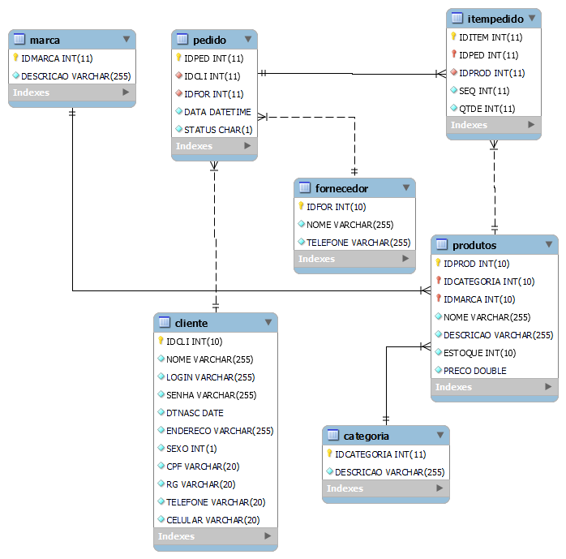

# 🚀 Sejam todos bem-vindos ao meu repositório CadCommerce

## Índice
- [Conexão de Banco de Dados](#conex%C3%A3o-de-banco-de-dados)
- [Descrição](#descri%C3%A7%C3%A3o)
- [Introdução](#introdu%C3%A7%C3%A3o)
- [Funcionalidades](#funcionalidades)
- [Tecnologias Utilizadas](#tecnologias-utilizadas)
- [Fontes Consultadas](#fontes-consultadas)
- [Autores](#autores)

# 💾 Conexão de Banco de Dados


# ✅ Descrição
Este código foi desenvolvido para demonstrar a configuração e utilização de uma conexão de banco de dados MySQL utilizando PHP. Ele faz parte do projeto CadCommerce.

# 📃 Introdução
Neste repositório, você encontrará exemplos de como configurar a conexão com o banco de dados, criar tabelas, e realizar operações CRUD (Create, Read, Update, Delete) usando PHP e MySQL.

## 🔧 Funcionalidades
- Configuração de conexão com banco de dados MySQL.
- Criação de tabelas no banco de dados.
- Inserção, leitura, atualização e exclusão de dados nas tabelas.

## 📁 Estrutura do Projeto
- `config.php`: Arquivo de configuração da conexão com o banco de dados.
- `categoria.php`: Gerenciamento de categorias.
- `marca.php`: Gerenciamento de marcas.
- `produto.php`: Gerenciamento de produtos.
- `pedido.php`: Gerenciamento de pedidos.
- `carrinho.php`: Gerenciamento do carrinho de compras.

## 📌 Tecnologias Utilizadas
- HTML5    
- CSS3   
- PHP 8.1   
- MySQL

# 📝 Métodos PHP Utilizados

## Configuração de Conexão
### `coneção.php`
```php
<?php
// Configurações do servidor de banco de dados
$servidor = "localhost"; // Nome do servidor onde o banco de dados está hospedado
$usuario = "root";       // Nome de usuário para acessar o banco de dados
$senha = "";             // Senha do usuário para acessar o banco de dados
$dbname = "cadcommerce"; // Nome do banco de dados a ser utilizado

// Criação de uma nova conexão MySQLi com o servidor e banco de dados especificados
$mysqli = new mysqli($servidor, $usuario, $senha, $dbname);

// Verifica se houve algum erro na conexão
if ($mysqli->connect_error) {
    // Em caso de erro na conexão, exibe uma mensagem e encerra o script
    die("Falha na conexão: " . $mysqli->connect_error);
}

// Se a conexão for bem-sucedida, o código continuará a partir daqui
?>

```
## Configuração de produto
### `produtos_3A.php`
```php
<?php
    // Inclui o arquivo de conexão com o banco de dados
    include_once('controller/conexao.php');
?>
<!DOCTYPE html>
<html lang="en">
<head>
    <meta charset="UTF-8">
    <meta http-equiv="X-UA-Compatible" content="IE=edge">
    <meta name="viewport" content="width=device-width, initial-scale=1.0">
    <title>Cadastro de produtos</title>
    <!-- Link para o arquivo CSS -->
    <link rel="stylesheet" href="css/style.css">
</head>
<body>
    <header>
        <div class="center">
            <h1>Cadastro de produto</h1>
            <!-- Link para voltar à página inicial -->
            <a href="index.php" target="_self">Voltar</a>
        </div>
    </header>
    <section id="produtos">
        <!-- Formulário para cadastro de produtos -->
        <form action="insere-produto.php" method="post">
            Nome: <input type="text" name="nome"><br>
            Descrição: <input type="text" name="descricao"><br>
            Estoque: <input type="number" name="estoque"><br>
            Preço: <input type="number" name="preco" min="0.00" max="10000.00" step="0.01"><br>
            Categoria:
            <!-- Seleção de categoria -->
            <select name="seleciona_categoria" id="">
                <option value="">selecione</option>
                <?php
                    // Consulta todas as categorias do banco de dados
                    $resultado_categoria = "SELECT * FROM categoria";
                    $resultadocategoria = mysqli_query($mysqli, $resultado_categoria);
                    // Loop para preencher o dropdown com as categorias
                    while($row_categorias = mysqli_fetch_assoc($resultadocategoria)){ ?>
                    <option value="<?php echo $row_categorias['IDCATEGORIA'] ?>">
                    <?php echo $row_categorias['DESCRICAO'] ?></option>
                 <?php
                    }
                ?>
            </select>
            <br>
            Marca:
            <!-- Seleção de marca -->
            <select name="seleciona_marca" id="">
                <option value="">selecione</option>
                <?php
                    // Consulta todas as marcas do banco de dados
                    $resultado_marca = "SELECT * FROM marca";
                    $resultadomarca = mysqli_query($mysqli, $resultado_marca);
                    // Loop para preencher o dropdown com as marcas
                    while($row_marcas = mysqli_fetch_assoc($resultadomarca)){ ?>
                    <option value="<?php echo $row_marcas['IDMARCA'] ?>">
                    <?php echo $row_marcas['DESCRICAO'] ?></option>
                 <?php
                    }
                ?>
            </select>
            <br><br>
            <!-- Botão para submeter o formulário -->
            <input type="submit" value="Cadastrar">
        </form>
    </section>
</body>
</html>
```
## Configuração de marca
### `marca.php`
```php
<!DOCTYPE html>
<html lang="en">
<head>
    <!-- Meta tags essenciais para a configuração da página -->
    <meta charset="UTF-8"> <!-- Define a codificação de caracteres como UTF-8 -->
    <meta http-equiv="X-UA-Compatible" content="IE=edge"> <!-- Define a compatibilidade com o Internet Explorer -->
    <meta name="viewport" content="width=device-width, initial-scale=1.0"> <!-- Configura a viewport para melhor renderização em dispositivos móveis -->

    <!-- Título da página que aparece na aba do navegador -->
    <title>Cadastro de marca</title>

    <!-- Link para o arquivo CSS externo para estilização da página -->
    <link rel="stylesheet" href="css/style.css">
</head>
<body>
    <!-- Cabeçalho da página -->
    <header>
        <div>
            <h1>Cadastro de marca</h1> <!-- Título principal da página -->
            <a href="index.php" target="_self">Voltar</a> <!-- Link para retornar à página inicial -->
        </div>
    </header>
    
    <!-- Seção principal da página destinada ao cadastro de marca -->
    <section id="produtos">
        <!-- Formulário para inserir uma nova marca -->
        <form action="insere-marca.php" method="post">
            <!-- Campo de entrada para a descrição da marca -->
            <label for="">Descrição: </label>
            <input type="text" name="descricao">
            <!-- Botão para enviar o formulário -->
            <input type="submit" value="Cadastrar">
        </form>
    </section>
</body>
</html>

```
## Configuração de categoria
### `categoria.php`
```php

<!DOCTYPE html>
<html lang="en">
<head>
    <!-- Meta tags essenciais para a configuração da página -->
    <meta charset="UTF-8"> <!-- Define a codificação de caracteres como UTF-8 -->
    <meta http-equiv="X-UA-Compatible" content="IE=edge"> <!-- Define a compatibilidade com o Internet Explorer -->
    <meta name="viewport" content="width=device-width, initial-scale=1.0"> <!-- Configura a viewport para melhor renderização em dispositivos móveis -->

    <!-- Título da página que aparece na aba do navegador -->
    <title>Cadastro de Categorias</title>

    <!-- Link para o arquivo CSS externo para estilização da página -->
    <link rel="stylesheet" href="css/style.css">
</head>
<body>
    <!-- Cabeçalho da página -->
    <header>
        <div>
            <h1>Cadastro de Categoria</h1> <!-- Título principal da página -->
            <a href="index.php" target="_self">Voltar</a> <!-- Link para retornar à página inicial -->
        </div>
    </header>
    
    <!-- Seção principal da página destinada ao cadastro de categoria -->
    <section id="produtos">
        <!-- Formulário para inserir uma nova categoria -->
        <form action="insere-categoria.php" method="post">
            <!-- Campo de entrada para a descrição da categoria -->
            <label for="">Descrição: </label>
            <input type="text" name="descricao">
            <!-- Botão para enviar o formulário -->
            <input type="submit" value="Cadastrar">
        </form>
    </section>
</body>
</html>

```
## inserindo categorias no banco
### `insere_produto.php`
```php
<?php
    // Inclui o arquivo de conexão com o banco de dados
    include_once('controller/conexao.php');

    // Obtém os dados do formulário via POST
    $categoria      = $_POST['seleciona_categoria']; // ID da categoria selecionada
    $marca          = $_POST['seleciona_marca'];   // ID da marca selecionada
    $nome_produto   = $_POST['nome'];               // Nome do produto
    $descricao      = $_POST['descricao'];          // Descrição do produto
    $estoque        = $_POST['estoque'];            // Quantidade em estoque
    $preco          = $_POST['preco'];              // Preço do produto

    // Prepara a instrução SQL para inserir um novo produto na tabela 'produtos'
    $grava_produto = "INSERT INTO produtos(`IDCATEGORIA`, `IDMARCA`, `NOME`, `DESCRICAO`, `ESTOQUE`, `PRECO`) 
    VALUES ('$categoria', '$marca', '$nome_produto', '$descricao', '$estoque', '$preco')";

    // Executa a instrução SQL
    $result_gravacao = mysqli_query($mysqli, $grava_produto);

    // Verifica se a inserção foi bem-sucedida
    if (mysqli_affected_rows($mysqli) != 0) {
        // Se o produto foi cadastrado com sucesso, exibe uma mensagem e redireciona para a página de produtos
        echo "
        <META HTTP-EQUIV='REFRESH' CONTENT='0;URL=produtos.php'>
        <script type='text/javascript'>
        alert('Produto cadastrado com sucesso');
        </script>
        ";
    } else {
        // Se o produto não foi cadastrado, exibe uma mensagem de erro e redireciona para a página de produtos
        echo "
        <META HTTP-EQUIV='REFRESH' CONTENT='0;URL=produtos.php'>
        <script type='text/javascript'>
        alert('Produto não cadastrado');
        </script>
        ";
    }
?>
```
## inserindo marcas no banco
### `insere_marca.php`
```php
<?php
    // Inclui o arquivo de conexão com o banco de dados
    include('controller/conexao.php');

    // Obtém o valor da descrição enviado pelo método POST
    $descricao = $_POST['descricao'];

    // Exibe a descrição recebida do formulário
    echo "<h3>Descrição: $descricao </h3></br>";

    // Prepara a instrução SQL para inserir uma nova marca na tabela 'marca'
    $cad_marca = "INSERT INTO marca(`DESCRICAO`) VALUES ('$descricao')";

    // Executa a instrução SQL
    if (mysqli_query($mysqli, $cad_marca)) {
        // Se a marca for cadastrada com sucesso, exibe uma mensagem de sucesso
        echo "<h1>Marca cadastrada com sucesso!</h1></br>";
    } else {
        // Se ocorrer um erro na execução da consulta, exibe a mensagem de erro
        echo "Erro: " . $cad_marca . "</br>";
        echo "Erro SQL: " . mysqli_error($mysqli) . "</br>";
    }

    // Fecha a conexão com o banco de dados
    mysqli_close($mysqli);
?>

```
## inserindo categorias no banco de dados
### `insere_categoria.php`
```php
<?php
    // Inclui o arquivo de conexão com o banco de dados
    include('controller/conexao.php');

    // Obtém o valor da descrição enviado pelo método POST
    $descricao = $_POST['descricao'];

    // Exibe a descrição recebida do formulário
    echo "<h3>Descrição: $descricao </h3></br>";

    // Prepara a instrução SQL para inserir uma nova categoria na tabela 'categoria'
    $cad_categoria = "INSERT INTO categoria(`DESCRICAO`) VALUES ('$descricao')";

    // Executa a instrução SQL
    if (mysqli_query($mysqli, $cad_categoria)) {
        // Se a categoria for cadastrada com sucesso, exibe uma mensagem de sucesso
        echo "<h1>Categoria cadastrada com sucesso!</h1></br>";
    } else {
        // Se ocorrer um erro na execução da consulta, exibe a mensagem de erro
        echo "Erro: " . $cad_categoria . "</br>";
        echo "Erro SQL: " . mysqli_error($mysqli) . "</br>";
    }

    // Fecha a conexão com o banco de dados
    mysqli_close($mysqli);
?>

```
